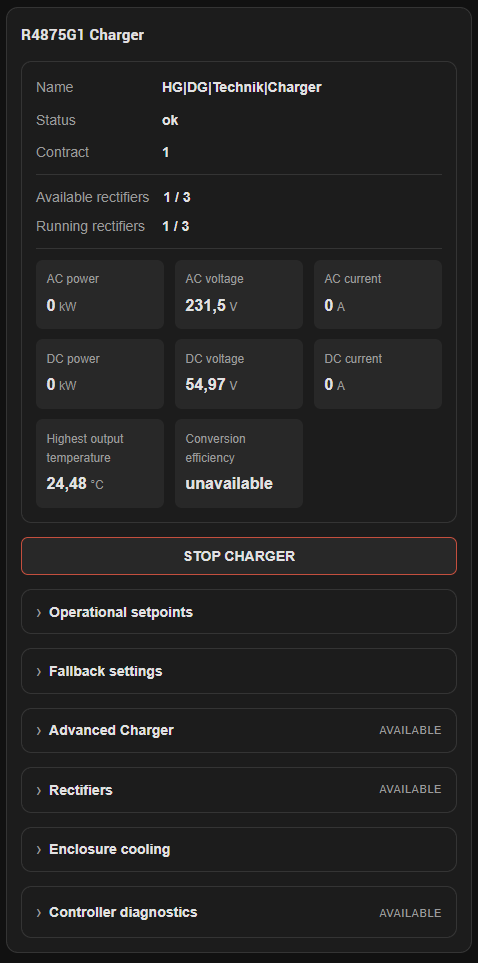
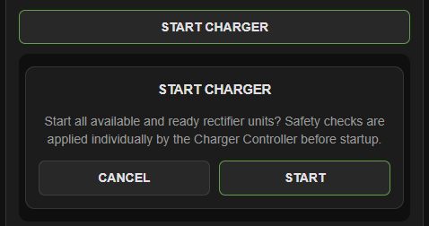
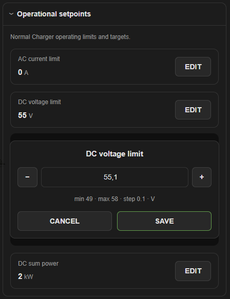
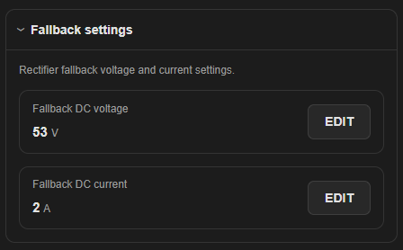
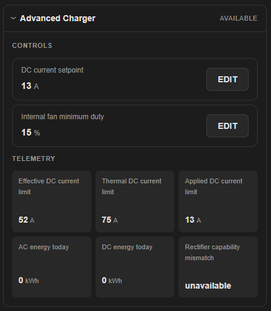
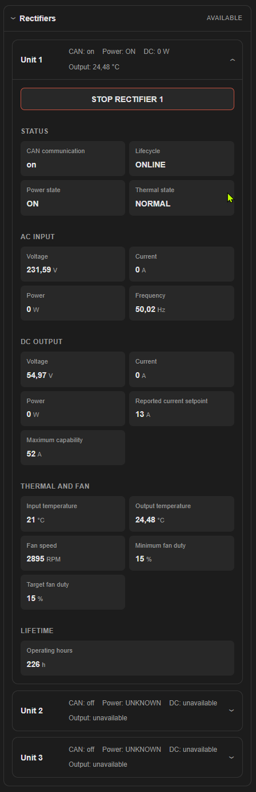
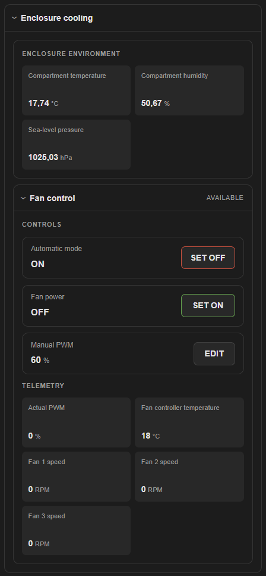
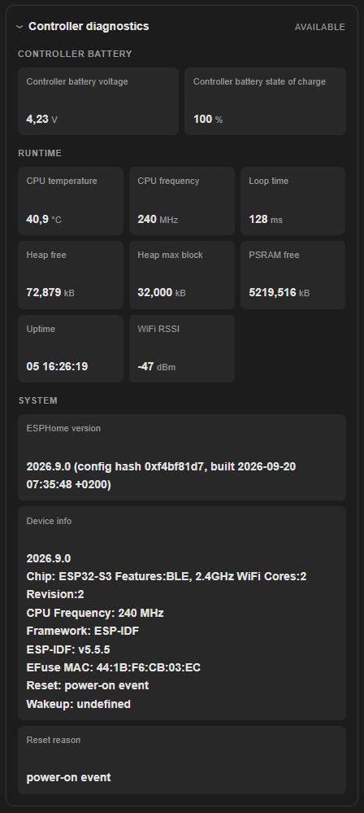

<p align="center">
  
</p>

# R4875G1 Charger Dashboard for Home Assistant

Home Assistant dashboard frontend for the R4875G1 three-phase charger project.

It consumes the stable semantic Backend API exposed by the separate `R4875G1 Charger` Home Assistant integration. The dashboard never depends on installation-specific ESPHome entity IDs and does not move charger safety or lifecycle authority away from the Charger Controller.

<p align="center">
  <a href="https://my.home-assistant.io/redirect/hacs_repository/?owner=anwa&repository=r4875g1-charger-dashboard&category=plugin">
    
  </a>
</p>

## Contents

- [Requirements](#requirements)
- [Installation](#installation)
- [Configuration](#configuration)
- [Dashboard guide](#dashboard-guide)
- [Updating](#updating)
- [Troubleshooting](#troubleshooting)
- [Architecture](#architecture)
- [HACS package](#hacs-package)
- [Branding](#branding)
- [Repository relationship](#repository-relationship)
- [Release status and compatibility](#release-status-and-compatibility)
- [Development](#development)
- [Removal](#removal)

## Requirements

- Home Assistant 2026.8 or newer
- HACS for the recommended installation method
- `R4875G1 Charger` Home Assistant integration 1.3.0 or newer
- a Charger Controller exposing Home Assistant Contract 1
- Backend API v1 available through the configured Charger integration

The backend integration must be installed and configured before this dashboard can connect to a Charger Instance.

## Installation

<details open>
<summary><b>Install with HACS (recommended)</b></summary>

HACS is the recommended installation and update method. Use the button above or add this repository manually as a custom Dashboard repository.

1. Open **HACS** in Home Assistant.
2. Open the three-dot menu in the upper-right corner.
3. Select **Custom repositories**.
4. Enter `https://github.com/anwa/r4875g1-charger-dashboard`.
5. Select **Dashboard** as the repository type.
6. Select **Add**.
7. Open **R4875G1 Charger Dashboard** in HACS.
8. Select **Download** and keep the newest stable release selected unless you intentionally need an older version.
9. Open **Settings -> Dashboards -> Resources** and verify that HACS registered the JavaScript module resource.

The HACS-managed resource should resolve through:

```text
/hacsfiles/r4875g1-charger-dashboard/r4875g1-charger-dashboard.js
```

HACS may append its own `hacstag` query parameter to the resource URL. Keep the HACS-managed resource unchanged.

After the resource is available, add the dashboard card as described under [Configuration](#configuration).

</details>

<details>
<summary><b>Manual installation</b></summary>

Manual installation remains available as a development or fallback path.

1. Download or clone the desired release.
2. Copy `dist/r4875g1-charger-dashboard.js` to `/config/www/r4875g1-charger-dashboard.js`.
3. Open **Settings -> Dashboards -> Resources**.
4. Add `/local/r4875g1-charger-dashboard.js` as a **JavaScript module**.
5. Refresh the browser.
6. Add the card as described under [Configuration](#configuration).

Manual installations are not managed by HACS and therefore do not receive HACS update notifications.

</details>

### Migrating from the previous manual `/local` installation

If the dashboard was previously loaded manually from:

```text
/local/r4875g1-charger-dashboard.js
```

install the repository through HACS first and verify that the HACS resource exists. Then remove the old manual `/local/...` resource so that Home Assistant does not load two copies of the same custom element.

Do not keep both the manual and HACS resource entries active.

## Configuration

Add the overview card with:

```yaml
type: custom:r4875g1-charger-overview-card
```

When exactly one Charger Instance is available, it is selected automatically.

For installations with multiple Charger Instances, configure the desired backend config entry explicitly:

```yaml
type: custom:r4875g1-charger-overview-card
config_entry_id: YOUR_CONFIG_ENTRY_ID
```

### Current overview capabilities

The current frontend provides:

- aggregate AC power, voltage and current
- aggregate DC power, voltage and current
- highest rectifier output temperature
- conversion efficiency
- available and running rectifier counts
- optional advanced Charger monitoring for effective, thermal and applied DC current limits, daily AC/DC energy and rectifier capability mismatch
- advanced DC current-setpoint control using Backend API Number metadata
- internal rectifier-fan minimum-duty control using Backend API Number metadata
- expandable live detail views for Rectifier Units 1-3
- per-rectifier START and STOP with confirmation and observed-state completion
- enclosure environment telemetry for the Charger housing
- enclosure fan control with automatic mode, fan power, manual PWM and live fan telemetry
- Charger-wide START and STOP with confirmation
- collapsible Operational setpoints for AC current, DC voltage and DC sum-power limits
- separate collapsible fallback DC voltage and current controls
- collapsible Advanced Charger, Rectifiers, Enclosure cooling and Controller diagnostics sections
- expandable live detail views for Rectifier Units 1-3
- per-rectifier START and STOP with confirmation and observed-state completion
- observed-state confirmation after operational commands and setpoint writes
- optional Controller diagnostics for battery, CPU, memory, loop timing, uptime, WiFi and Controller software state

Additional Advanced Charger button controls and trend/history presentation remain later milestones.


## Dashboard guide

The overview card is designed to keep the most important Charger state visible while larger detail areas remain collapsed until needed.

<p align="center">
  
</p>

From top to bottom, the card contains:

1. the always-visible Charger status summary
2. the Charger-wide START or STOP control
3. collapsible Operational setpoints and Fallback settings
4. collapsible Advanced Charger data and controls when the capability is available
5. collapsible Rectifier details
6. collapsible Enclosure cooling
7. collapsible Controller diagnostics when the capability is available

The dashboard only presents state and sends semantic control requests. Charger lifecycle, safety checks, thermal protection, START eligibility and actual state transitions remain authoritative in the Charger Controller.

### Charger status and START/STOP

The status summary stays visible at the top of the card. It shows the Charger Instance name, overall status, contract version, available and running Rectifier counts, aggregate AC/DC values, highest Rectifier output temperature and conversion efficiency.

Directly below the summary is the Charger-wide **START CHARGER** or **STOP CHARGER** button. The action shown depends on the observed Charger state.

START and STOP use a confirmation dialog before a command is sent:

<p align="center">
  
</p>

A successful Home Assistant service call is not treated as proof that the Charger changed state. The dashboard waits for the corresponding semantic state update from the backend. If the expected state is not observed within the UI timeout, the control reports a timeout instead of showing an optimistic result.

### Operational setpoints

Expand **Operational setpoints** to edit the normal Charger operating limits and targets.

<p align="center">
  
</p>

The section currently contains:

- **AC current limit**
- **DC voltage limit**
- **DC sum power**

Select **EDIT** on a value to open the Number editor. The editor shows the minimum, maximum, step and unit supplied by the Backend API. Use the minus and plus buttons or enter the value directly, then select **SAVE**.

The dashboard waits for the changed semantic value to be observed before it presents the write as completed.

### Fallback settings

**Fallback settings** is kept separate from the normal operating setpoints because these values are used for Rectifier fallback behavior rather than normal Charger control.

<p align="center">
  
</p>

The section contains:

- **Fallback DC voltage**
- **Fallback DC current**

The editor and observed-state behavior are the same as for Operational setpoints.

### Advanced Charger

When the backend exposes the optional Advanced Charger capability, the **Advanced Charger** section becomes available.

<p align="center">
  
</p>

It can contain:

- DC current-setpoint control
- internal Rectifier-fan minimum-duty control
- effective DC current limit
- thermal DC current limit
- applied DC current limit
- AC energy today
- DC energy today
- Rectifier capability mismatch

This section refers to Charger-level and Rectifier-related advanced functions. It is intentionally separate from **Enclosure cooling**, which controls the fans of the Charger housing rather than the internal Rectifier fans.

### Rectifiers

Expand **Rectifiers** to inspect the individual R4875G1 units.

<p align="center">
  
</p>

Each Rectifier has its own collapsible row. The collapsed row provides a compact summary such as CAN state, power state, DC power and output temperature. Expanding a unit shows:

- per-Rectifier START or STOP control
- CAN, lifecycle, power and thermal state
- AC input voltage, current, power and frequency
- DC output voltage, current and power
- reported current setpoint and maximum current capability
- input and output temperatures
- internal Rectifier fan speed, minimum duty and target duty
- operating hours

The **Thermal and fan** group in this section belongs to the Rectifier itself. It must not be confused with the separate enclosure fans described below.

### Enclosure cooling

**Enclosure cooling** contains the climate information and fan controls for the Charger housing or cabinet. It is deliberately named separately from Rectifier cooling.

<p align="center">
  
</p>

The **Enclosure environment** area shows:

- compartment temperature
- compartment humidity
- sea-level pressure

The nested **Fan control** section is available when the optional enclosure-fan capability is exposed by the backend. It contains:

- **Automatic mode** — enables or disables automatic enclosure-fan control
- **Fan power** — switches enclosure-fan power
- **Manual PWM** — sets the requested manual PWM value
- **Actual PWM** — reports the applied PWM
- **Fan controller temperature**
- **Fan 1 / Fan 2 / Fan 3 speed**

Switch controls use confirmation and observed-state completion. Number controls use Backend API minimum, maximum, step and unit metadata and likewise wait for the changed value to be observed.

### Controller diagnostics

When the optional Controller diagnostics capability is available, expand **Controller diagnostics** to inspect Controller power, runtime and software information.

<p align="center">
  
</p>

The diagnostics section is divided into:

- **Controller battery** — backup-battery voltage and state of charge
- **Runtime** — CPU temperature and frequency, loop time, heap, PSRAM, uptime and WiFi RSSI
- **System** — ESPHome version, device information and reset reason

CPU frequency is displayed in MHz, memory values in kB with three decimal places, and uptime as `dd hh:mm:ss`.

The Device Info value is split into separate lines at the Controller-provided `|` separators to keep the long ESP32/ESP-IDF information readable on narrow dashboard cards.


## Updating

HACS tracks the repository after installation and can offer a newer stable GitHub Release when one is published.

To install an update:

1. Open the Home Assistant update notification or **R4875G1 Charger Dashboard** in HACS.
2. Review the release notes.
3. Install the offered update.
4. Reload the affected dashboard or refresh the browser if the frontend was already open.

HACS serves dashboard resources through `/hacsfiles/` with cache-control behavior intended for managed dashboard elements, so version query strings such as the old `/local/...js?v=...` development workflow are not required for the HACS resource.

To request an immediate metadata refresh after a release is published, open the repository in HACS, open its three-dot menu and select **Update information**.

Refreshing repository information does not install a new version by itself.

## Troubleshooting

### The card type is not found after HACS installation

Verify that HACS downloaded the repository and that **Settings -> Dashboards -> Resources** contains the HACS-managed module.

The expected resource path begins with:

```text
/hacsfiles/r4875g1-charger-dashboard/
```

If the resource exists, refresh the browser before adding the card again.

### The old card is still loaded after migrating to HACS

Check **Settings -> Dashboards -> Resources** for a remaining manual `/local/r4875g1-charger-dashboard.js` entry.

Only the HACS-managed `/hacsfiles/...` resource should remain after migration.

### No Charger Instance is available

The separate `R4875G1 Charger` backend integration must already be configured and must have a compatible Charger Controller online.

Verify:

- the ESPHome Charger Controller exists in Home Assistant
- the R4875G1 Charger integration is configured for that Controller
- Home Assistant Contract 1 is available
- the backend integration reports the Charger Instance as usable

### Multiple Charger Instances are found

Automatic selection is intentionally limited to installations with exactly one Charger Instance.

Set the desired backend config entry explicitly:

```yaml
type: custom:r4875g1-charger-overview-card
config_entry_id: YOUR_CONFIG_ENTRY_ID
```

### HACS does not show a newly published release

HACS follows published GitHub Releases for this repository.

Use **three-dot menu -> Update information** on the repository to request a metadata refresh.

If the new version is still unavailable, verify that it was published as a GitHub Release and not only created as a Git tag.

### A control call succeeds but the displayed state does not change

The dashboard intentionally does not treat a successful Home Assistant service call as proof that the Charger Controller changed state.

START, STOP, Switch and Number controls wait for semantic state updates from the backend. If the expected Controller state is not observed within the configured UI timeout, the dashboard reports a timeout instead of presenting an optimistic state.

## Architecture

The dashboard consumes Backend API v1 from the separate `R4875G1 Charger` Home Assistant integration.

The frontend uses semantic roles such as:

```text
charger.ac.power
charger.dc.voltage
charger.command.start
charger.ac.current_limit
charger.fallback.voltage_setpoint
```

It does not use installation-specific ESPHome entity IDs.

The backend resolves semantic roles, enforces Home Assistant permissions and exposes semantic control metadata for writable Number and Switch roles. The frontend renders state and dispatches allow-listed semantic controls through that backend without knowing Home Assistant entity IDs, domains or service names.

The Charger Controller remains authoritative for:

- charger lifecycle
- CAN communication
- thermal protection
- START eligibility
- blackstart behavior
- rectifier safety checks
- actual Controller state transitions

The dashboard is an HMI only.

## HACS package

The HACS Dashboard package is described by `hacs.json`.

The distributable frontend bundle is:

```text
dist/r4875g1-charger-dashboard.js
```

The repository name and JavaScript filename intentionally match:

```text
r4875g1-charger-dashboard
r4875g1-charger-dashboard.js
```

HACS therefore discovers the bundle directly from `dist/`.

When GitHub Releases exist, HACS uses the selected release contents when downloading or upgrading. Stable HACS updates therefore require a published GitHub Release, not only a Git tag.

Repository validation is performed by:

```text
.github/workflows/validate.yml
```

using the official HACS validation action with repository category `plugin`.

## Branding

Repository branding is stored in:

```text
brand/
├── icon.png
├── logo.png
└── README.md
```

`icon.png` is a 256 x 256 square PNG.

`logo.png` is a 768 x 256 landscape PNG. Its shortest side is 256 pixels.

The README uses an absolute raw GitHub URL for `logo.png` so that HACS and other renderers outside the normal GitHub repository context can resolve the image.

These assets identify the dashboard repository. They are separate from the local integration brand assets shipped by the backend integration.

## Repository relationship

Backend Home Assistant integration:

```text
anwa/homeassistant-r4875g1-charger
```

Controller and Remote HMI firmware:

```text
anwa/esphome-r4875g1-3phase-charger
```

The firmware defines the authoritative Home Assistant Contract. The backend resolves that contract into Backend API v1. This repository renders the resulting semantic state and controls.

## Release status and compatibility

Version 0.12.0 is the dashboard usability and documentation milestone. It consolidates the 0.11.1-0.11.3 refinements into the next HACS-facing release, with reusable collapsible sections, clearer Enclosure cooling terminology, improved Controller diagnostics formatting and a complete visual dashboard guide.

The dashboard is still pre-1.0 software. Minor versions may add substantial new frontend capabilities, while the backend API and Home Assistant Contract remain independently versioned.

Current baseline:

- Home Assistant 2026.8 or newer
- Backend API v1
- R4875G1 Charger backend 1.3.0 or newer
- Home Assistant Contract 1

A future breaking dashboard configuration change should be documented explicitly in the corresponding release notes.

## Development

Install dependencies:

```text
npm install
```

Run the TypeScript check:

```text
npm run typecheck
```

Build the dashboard bundle:

```text
npm run build
```

The build output is:

```text
dist/r4875g1-charger-dashboard.js
```

Before committing a functional or packaging change, run:

```text
npm run typecheck
npm run build
git diff --check
```

## Removal

To remove the dashboard completely:

1. Remove cards using `custom:r4875g1-charger-overview-card` from Home Assistant dashboards.
2. Remove **R4875G1 Charger Dashboard** from HACS if it was installed through HACS.
3. Verify that the HACS-managed resource was removed from **Settings -> Dashboards -> Resources**.
4. Remove any remaining manual `/local/r4875g1-charger-dashboard.js` resource if an older manual installation existed.

Removing this dashboard does not remove the backend integration, the ESPHome Charger Controller device or the Controller firmware.
